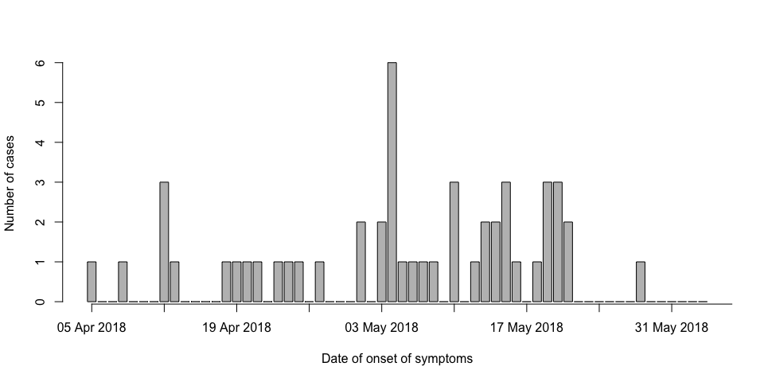
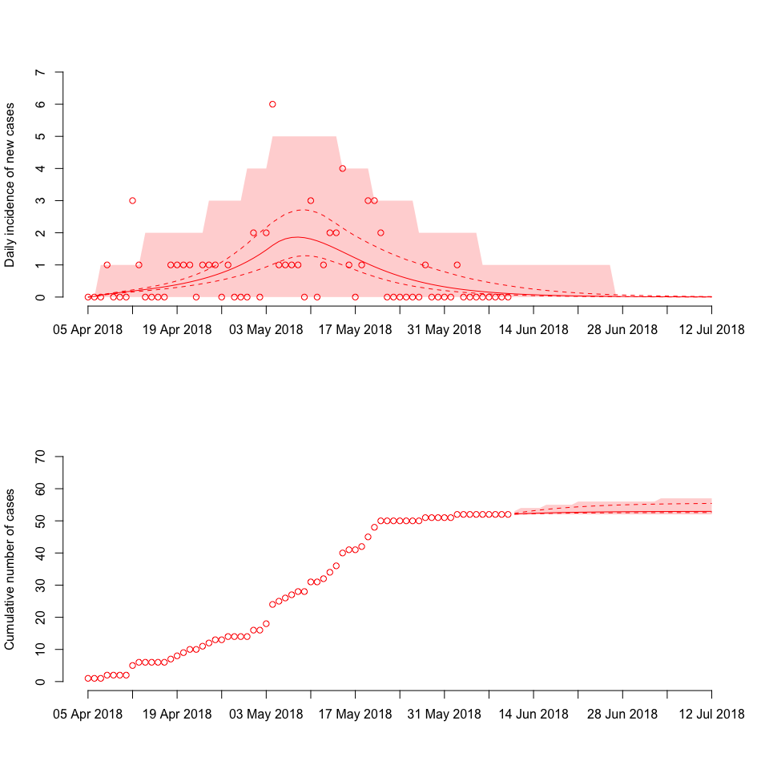
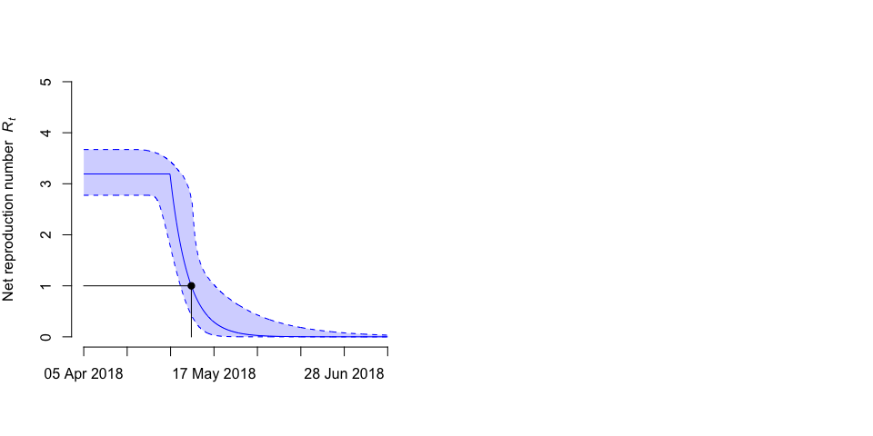

Real-time analysis of the 2018 Ebola outbreak in the Democratic Republic of Congo
================

4 June 2018

Christian L. Althaus (<christian.althaus@alumni.ethz.ch>)
Institute of Social and Preventive Medicine, University of Bern, Bern, Switzerland

Introduction
------------

The Democratic Republic of Congo (DRC) currently experiences an outbreak of Ebola virus disease (EVD). According to [WHO situation reports](http://www.who.int/ebola/situation-reports/drc-2018/en/), the outbreak began in early April 2018 and remains localized to three health zones (Iboko, Bikoro and Wangata) in the north-west of DRC.

Real-time analyses of the transmission dynamics of this outbreak are important for anticipating further spread of EVD and investigating the effects of control interventions. The transmission potential of an infectious disease can be described by the basic reproduction number (*R*0) that describes the average number of secondary infections generated by an infectious index case at the beginning of an outbreak. An outbreak can be brought under control once the net reproduction number *R**t* drops below unity.

Based the same methodology that we developed for analyzing the 2014 EVD outbreak in DRC [(Althaus, 2015)](https://peerj.com/articles/1418/), this document provides a real-time analysis of the current outbreak using the most recent data of reported cases from the WHO situation reports (Figure 1).

**Figure 1. Confirmed and probable EVD cases in the Democratic Republic of Congo (DRC)** The [WHO situation report](http://apps.who.int/iris/bitstream/handle/10665/272728/SITREP-EVD-DRC-20180601-eng.pdf?ua=1) from 1 June 2018 reported 50 confirmed and probable EVD cases until 29 May 2018.

Outbreak analysis and projection
--------------------------------

**Figure 2. Dynamics of EVD outbreak in the Democratic Republic of Congo (DRC).** Model fits of daily incidence (left panel) and projections for cumulative numbers (right panel) of cases are shown together with reported data (circles). The best-fit model (solid lines) is given together with the 95% confidence intervals (dashed lines). The shaded areas correspond to the 95% prediction intervals.

**Figure 3. Net reproduction number *R**t* during the Ebola virus disease (EVD) outbreak in the Democratic Republic of Congo (DRC).** The maximum likelihood estimates of the net reproduction number *R**t* (solid line) are shown together with the 95% confidence intervals (dashed lines). The black dot denotes the time at which *R**t* dropped below unity.
